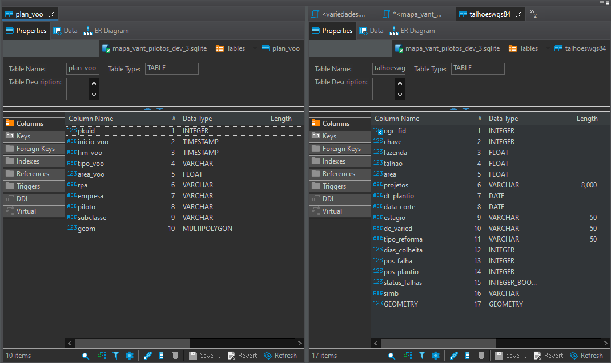
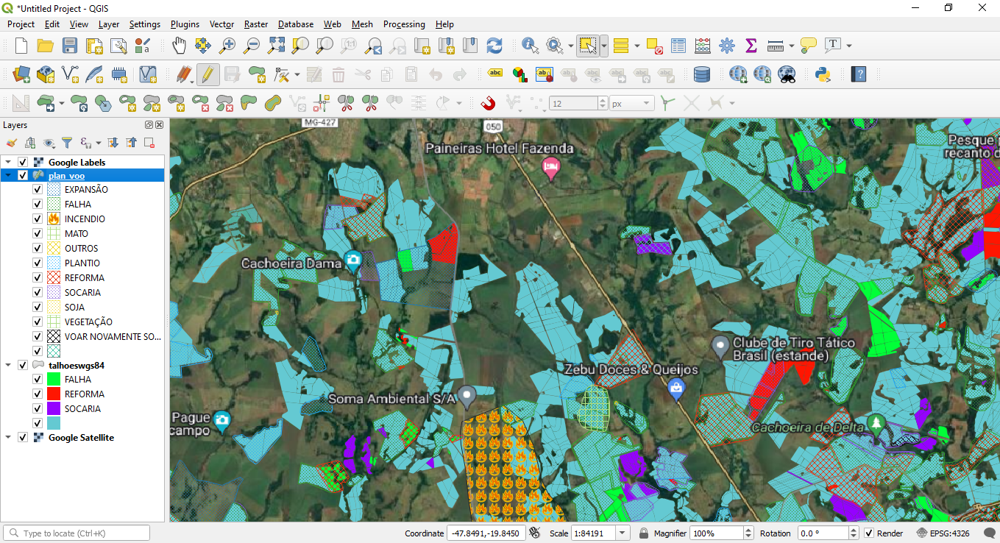

## Mapa de voos para pilotos de VANTS

A ideia surgiu para melhorar uma versão já existente, as principais propostas são adaptar o sistema para trabalhar com
múltiplos pilotos e mudar o banco de dados central de Oracle para Postgres. O projeto é voltado para o uso de
ferramentas de geoprocessamento, nesse caso, estou usando o QGIS.

O banco de dado central tem uma composição única, pois depende de algumas views procedentes de tabelas internas, das
quais não posso expor aqui, porém, o banco de amostra, utilizado pelos pilotos é como se fosse uma versão 'estática'
desse banco, contendo apenas alguns triggers próprios, para armazenar um histórico, por exemplo.

Os scripts deste projeto são executados sempre que um ou mais pilotos voltarem do campo com dados a sincronizar, ou seja,
são dedicados a fazer essa migração e manter todos os bancos atualizados.

Abaixo um exemplo das principais tabelas utilizadas no sistema:

O administrador do banco central e os pilotos podem interagir e manipular os dados através da ferramenta citada acima.

A imagem abaixo mostra um exemplo do projeto aberto no QGIS:
